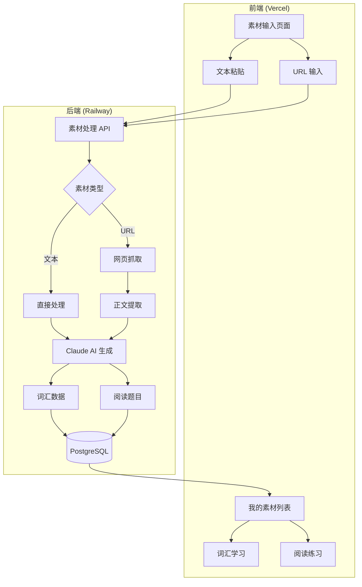
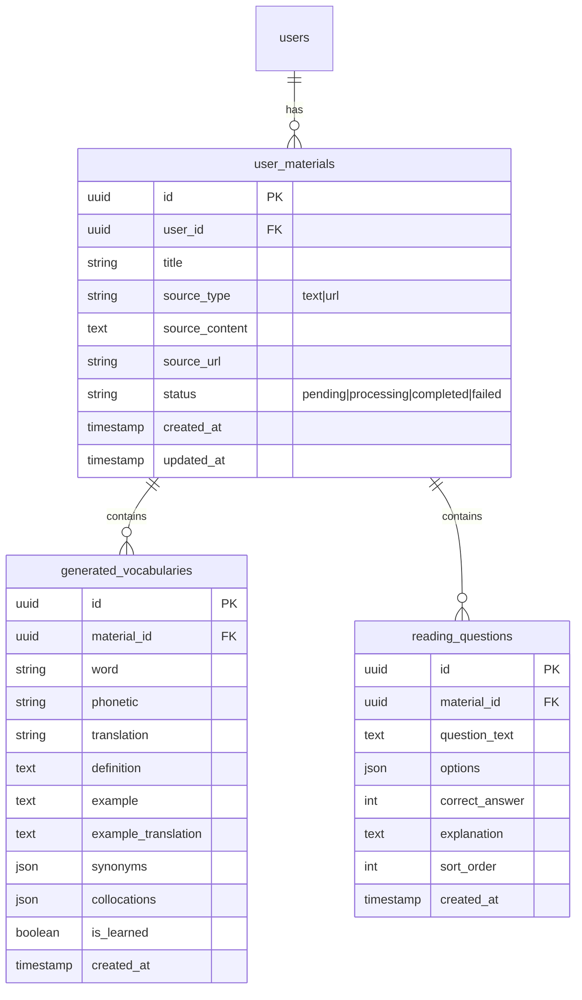

## 产品概述

为 English Mastery 平台添加"用户自定义学习资料"功能，让用户能够提供自己的学习素材（文本、链接等），系统利用 AI 自动生成个性化的词汇学习和阅读练习内容，实现精准学习。

## 核心功能

### 1. 素材输入系统

- **文本粘贴**：用户直接输入或粘贴英文文本（文章、邮件、报告等）
- **链接抓取**：用户输入网页 URL，系统自动抓取页面正文内容
- 支持素材预览和编辑

### 2. AI 内容生成引擎

- 调用 Claude API 分析素材内容
- **词汇生成**：提取生词/难词，生成音标、释义、例句、同义词等
- **阅读材料生成**：整理原文，标注生词，生成阅读理解题目

### 3. 自定义学习模块

- 独立的"我的素材"管理页面
- 生成的词汇可进入闪卡学习流程
- 生成的阅读材料可进行阅读理解练习
- 学习进度独立追踪

### 4. MVP 范围（本次实现）

- 输入方式：文本粘贴 + URL 链接
- 学习模块：词汇学习 + 阅读练习
- 用户素材持久化存储

## 技术栈

### 后端技术

| 技术 | 用途 |
| --- | --- |
| FastAPI | Web 框架（复用现有） |
| SQLAlchemy 2.0 | 数据库 ORM（复用现有） |
| Claude API (Anthropic) | AI 内容生成 |
| httpx | 网页内容抓取 |
| BeautifulSoup4 | HTML 解析提取正文 |
| Alembic | 数据库迁移 |


### 前端技术

| 技术 | 用途 |
| --- | --- |
| HTML5/CSS3/JavaScript | 页面开发（复用现有模式） |
| Web Speech API | TTS 发音（复用现有） |


## 实现方案

### 核心架构

采用异步处理架构，用户提交素材后，后端异步调用 Claude API 生成内容，前端轮询或 WebSocket 获取生成状态。

### 系统架构图



### 数据模型设计



### AI 生成策略

1. **词汇提取 Prompt 设计**：

- 提取文本中的难词/专业词汇（约 10-20 个）
- 生成音标、中英文释义、例句、同义词、常见搭配
- 按难度排序，优先提取用户可能不熟悉的词汇

2. **阅读题目生成 Prompt 设计**：

- 基于原文生成 3-5 道理解题
- 题目类型：主旨理解、细节理解、推断题
- 每题 4 个选项，附带答案解析

3. **性能优化**：

- 单次 API 调用同时生成词汇和题目，减少延迟
- 结果缓存，避免重复生成
- 限制素材长度（最大 5000 字符）

## 实现注意事项

### 性能考量

- Claude API 调用可能耗时 10-30 秒，必须异步处理
- 前端使用轮询（每 2 秒）检查生成状态
- 网页抓取设置 10 秒超时，失败则提示用户改用文本粘贴

### 数据安全

- 新增数据表使用 Alembic 迁移，不影响现有数据
- 用户素材与用户 ID 关联，隔离访问
- URL 抓取需验证合法性，防止 SSRF 攻击

### 日志记录

- 复用现有 logging 配置
- 记录 AI 调用耗时、成功/失败状态
- 敏感内容不记录到日志

### 兼容性

- 新增 API 路由 `/api/v1/materials`，不影响现有接口
- 前端新增独立页面，不修改现有学习模块
- 遵循现有代码风格和 Notion 设计规范

## 目录结构

### 后端文件

```
backend/
├── app/
│   ├── api/v1/
│   │   ├── __init__.py          # [MODIFY] 注册 materials 路由
│   │   └── materials.py         # [NEW] 素材管理 API：上传、获取、删除素材，获取生成结果
│   ├── models/
│   │   └── material.py          # [NEW] 数据模型：UserMaterial, GeneratedVocabulary, ReadingQuestion
│   ├── schemas/
│   │   └── material.py          # [NEW] Pydantic schemas：请求/响应数据结构定义
│   ├── services/
│   │   ├── ai_service.py        # [NEW] Claude AI 服务：Prompt 构建、API 调用、结果解析
│   │   └── scraper_service.py   # [NEW] 网页抓取服务：URL 验证、内容抓取、正文提取
│   └── config.py                # [MODIFY] 添加 ANTHROPIC_API_KEY 配置
├── alembic/versions/
│   └── xxxx_add_materials.py    # [NEW] 数据库迁移：创建素材相关表
└── requirements.txt             # [MODIFY] 添加 anthropic, beautifulsoup4 依赖
```

### 前端文件

```
pages/
└── materials.html               # [NEW] 我的素材页面：素材上传、列表管理、学习入口

js/
└── materials.js                 # [NEW] 素材页面逻辑：上传处理、状态轮询、学习跳转
```

## 关键代码结构

### AI 服务接口

```python
class AIService:
    """Claude AI 内容生成服务"""
    
    async def generate_learning_content(
        self, 
        text: str,
        max_words: int = 15,
        max_questions: int = 5
    ) -> GeneratedContent:
        """
        从文本生成学习内容
        
        Args:
            text: 原文内容
            max_words: 最多提取词汇数
            max_questions: 最多生成题目数
            
        Returns:
            GeneratedContent 包含词汇列表和题目列表
        """
        pass
```

### 素材数据模型

```python
class MaterialStatus(str, Enum):
    """素材处理状态"""
    PENDING = "pending"      # 待处理
    PROCESSING = "processing"  # 处理中
    COMPLETED = "completed"   # 已完成
    FAILED = "failed"        # 处理失败

class UserMaterial(Base):
    """用户素材表"""
    __tablename__ = "user_materials"
    
    id: Mapped[UUID]
    user_id: Mapped[UUID]
    title: Mapped[str]
    source_type: Mapped[str]  # text | url
    source_content: Mapped[str]
    source_url: Mapped[Optional[str]]
    status: Mapped[MaterialStatus]
    error_message: Mapped[Optional[str]]
    created_at: Mapped[datetime]
    updated_at: Mapped[datetime]
```

## 设计风格

遵循项目现有的 Notion 极简风格设计规范，使用黑白灰色调，无渐变效果。

### 页面布局

**素材上传区**

- 顶部标签切换：文本输入 / URL 链接
- 文本输入模式：大文本框，placeholder 提示用户可粘贴文章
- URL 模式：单行输入框，带"抓取"按钮
- 提交按钮使用纯黑背景（#191919）

**素材列表区**

- 卡片列表展示用户所有素材
- 每个卡片显示：标题、来源类型图标、状态、创建时间
- 状态徽章：处理中（灰色）、已完成（绿色）、失败（红色）
- 操作按钮：学习词汇、阅读练习、删除

**学习弹窗/页面**

- 复用现有词汇闪卡样式
- 复用现有阅读练习样式
- 仅数据来源不同，UI 保持一致

### 交互设计

- 上传后显示加载状态，进度文字提示
- 轮询检查状态，完成后自动刷新列表
- 操作按钮使用 Notion 风格图标按钮
- 悬停效果使用浅灰背景（#f7f6f3）

## Agent Extensions

### SubAgent

- **code-explorer**
- 目的：在实现过程中探索现有代码模式，确保新代码与现有架构保持一致
- 预期结果：快速定位参考代码，复用现有工具函数和设计模式