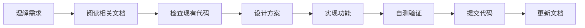

# 🤝 贡献指南 (Contributing Guide)

> 本文档面向所有参与者：人类开发者、AI 助手（CodeBuddy/Claude/GPT 等）、以及未来可能加入的协作者。

---

## 📖 首先阅读

加入项目前，请按顺序阅读以下文档：

| 顺序 | 文档 | 内容 | 必读 |
|------|------|------|------|
| 1 | `README.md` | 项目概述、功能特性、快速开始 | ✅ |
| 2 | `CONTRIBUTING.md` | 贡献指南（本文件） | ✅ |
| 3 | `ARCHITECTURE.md` | 架构设计、技术决策、为什么这样做 | ✅ |
| 4 | `AI_GUIDE.md` | AI 协作规范、上下文恢复 | ✅ (AI) |
| 5 | `DESIGN_GUIDE.md` | UI/UX 设计规范 | 🎨 (UI相关) |
| 6 | `PROJECT.md` | 详细技术实现 | 📚 (深入了解) |
| 7 | `CHANGELOG.md` | 更新历史 | 📝 (了解演进) |

---

## 🏗️ 项目结构

```
english-mastery/
├── 📄 README.md              # 项目入口文档
├── 📄 CONTRIBUTING.md        # 贡献指南（本文件）
├── 📄 ARCHITECTURE.md        # 架构决策记录
├── 📄 AI_GUIDE.md            # AI 协作指南
├── 📄 DESIGN_GUIDE.md        # UI 设计规范
├── 📄 PROJECT.md             # 详细技术文档
├── 📄 CHANGELOG.md           # 更新日志
├── 📄 DEPLOY_FREE.md         # 部署指南
│
├── 📁 .codebuddy/            # CodeBuddy AI 配置
│   ├── rules/                # AI 规则（自动加载）
│   └── plans/                # AI 计划文档
│
├── 📁 docs/                  # 扩展文档
│   ├── api/                  # API 文档
│   ├── decisions/            # 决策记录 (ADR)
│   └── guides/               # 使用指南
│
├── 📁 frontend/              # 前端代码
│   ├── index.html
│   ├── pages/
│   ├── css/
│   └── js/
│
└── 📁 backend/               # 后端代码
    ├── app/
    ├── alembic/              # 数据库迁移
    └── tests/
```

---

## ⚠️ 核心规则（必须遵守）

### 1. 数据安全 🔐

```
❌ 禁止：直接删除或重建数据库表
❌ 禁止：使用 drop_all/create_all
❌ 禁止：修改已有字段类型（可能丢失数据）

✅ 必须：使用 Alembic 迁移
✅ 必须：新字段有默认值或允许 NULL
✅ 必须：变更前备份数据
```

### 2. 设计规范 🎨

```
❌ 禁止：使用彩色渐变 linear-gradient
❌ 禁止：使用彩色 emoji 作为导航图标
❌ 禁止：强烈的阴影和 3D 效果

✅ 必须：遵循 Notion 极简风格
✅ 必须：使用黑白灰配色系统
✅ 必须：参考 DESIGN_GUIDE.md
```

### 3. 代码规范 📝

```
后端 (Python):
- 使用 async/await 异步编程
- 类型注解必须完整
- 错误要有友好的中文提示

前端 (JavaScript):
- 使用原生 ES6+ 语法
- 避免引入大型框架
- 保持文件独立性
```

### 4. Git 规范 📦

```bash
# 提交信息格式
<type>: <description>

# type 类型
feat:     新功能
fix:      修复 bug
docs:     文档更新
style:    样式调整（不影响逻辑）
refactor: 重构
perf:     性能优化
test:     测试相关
chore:    构建/工具变更

# 示例
feat: 用户素材管理功能
fix: 修复登录状态丢失问题
docs: 更新 API 文档
```

---

## 🔄 开发流程

### 添加新功能



### 具体步骤

1. **理解需求** - 明确要做什么
2. **阅读文档** - 检查是否有相关规范
3. **检查代码** - 了解现有实现
4. **设计方案** - 考虑兼容性和扩展性
5. **实现功能** - 遵循代码规范
6. **自测验证** - 确保功能正常
7. **提交代码** - 使用规范的提交信息
8. **更新文档** - 维护文档同步

---

## 🗄️ 数据库变更流程

```bash
# 1. 创建迁移文件
cd backend
alembic revision -m "描述变更"

# 2. 编辑迁移文件
# backend/alembic/versions/xxx_描述变更.py

# 3. 本地测试
alembic upgrade head

# 4. 提交代码（Railway 会自动执行迁移）
git add .
git commit -m "feat: 添加xxx表"
git push
```

---

## 🚀 部署流程

### 自动部署

推送到 `main` 分支后自动触发：

| 平台 | 内容 | 触发条件 |
|------|------|----------|
| Vercel | 前端 | 任何文件变更 |
| Railway | 后端 | `backend/` 目录变更 |

### 手动检查

```bash
# 检查后端健康状态
curl https://english-mastery-production.up.railway.app/health

# 检查前端
访问 https://english-mastery-app.vercel.app
```

---

## 🤖 AI 协作须知

如果你是 AI 助手（CodeBuddy、Claude、GPT 等），请特别注意：

### 必读文件

```
1. AI_GUIDE.md        - AI 专用协作指南
2. .codebuddy/rules/  - 自动加载的规则
```

### 上下文恢复

新会话开始时，请：

1. 阅读 `AI_GUIDE.md` 了解项目当前状态
2. 检查 `CHANGELOG.md` 了解最近更新
3. 查看 `.codebuddy/rules/` 中的规则

### 操作规范

```
✅ 使用 Alembic 迁移数据库
✅ 遵循 Notion 设计风格
✅ 保护现有用户数据
✅ 更新相关文档

❌ 不要删除数据库表
❌ 不要使用彩色渐变
❌ 不要破坏现有功能
```

---

## 📞 联系方式

- **项目维护者**: felixqi
- **协作 AI**: CodeBuddy (Claude)

---

## 📝 文档更新记录

| 日期 | 更新内容 |
|------|----------|
| 2026-02-28 | 创建贡献指南 |

---

*最后更新: 2026-02-28*
